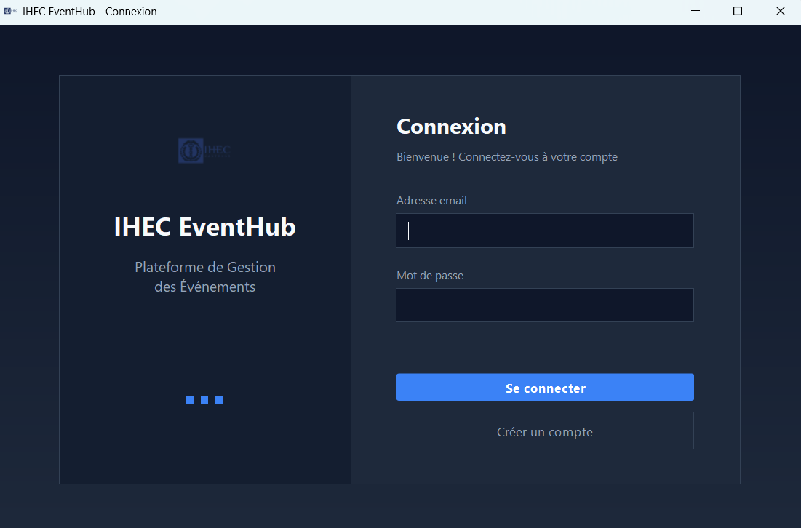

# IHEC EventHub 🎓

Application Java pour gérer les événements et les réservations de salles à l'IHEC, avec rôles (Admin, Responsable de club, Étudiant), interface Swing moderne et logique métier claire (models / services / UI).

## ✨ Fonctionnalités

- **Authentification & rôles** :
  - Admin, Responsable de club, Étudiant
- **Admin** :
  - Gestion des salles (création, suppression, équipements…)
  - Validation / refus des réservations avec motif
  - Gestion des utilisateurs
  - Statistiques globales (nb utilisateurs, salles, événements, réservations)
- **Responsable de club** :
  - Création d'événements
  - Demande de réservation de salle
  - Consultation / annulation des demandes
- **Étudiant** :
  - Consultation des salles disponibles
  - Consultation du calendrier des événements
- **Interface graphique** :
  - Écran de connexion moderne (`LoginFrame`)
  - Dashboards par rôle (`AdminDashboard`, `ResponsableDashboard`, `EtudiantDashboard`)
- **Version console** :
  - Menu texte complet dans `src/Main/java/Main.java`

## 🛠️ Architecture & technologies

- Langage : **Java**
- Interface : **Swing**
- Organisation du code :
  - `src/models` : `Salle`, `Evenement`, `Reservation`, `Utilisateur`, `Admin`, `Etudiant`, `ResponsableClub`, enums (`TypeSalle`, `TypeEvenement`, `StatutReservation`, etc.)
  - `src/service` : `GestionUtilisateurs`, `GestionSalles`, `GestionEvenements`, `GestionReservations` (Singleton)
  - `src/ui` : interfaces graphiques (login + dashboards)
  - `src/Main/java/Main.java` : version console
- Ressources :
  - `src/ui/resources/ihec_logo.png`

## 🚀 Installation & exécution

1. Cloner le dépôt :
   ```bash
   git clone https://github.com/khawlachaabi/projet-ihec-eventhub.git
   cd projet_ihec_eventhub
   ```
2. Ouvrir le projet dans un IDE Java (IntelliJ / Eclipse / NetBeans) :
   - Marquer `src` comme **Source Root** si nécessaire.
3. Lancer l'**interface graphique** :
   - Exécuter la classe `ui.LoginFrame`
4. Lancer la **version console** :
   - Exécuter la classe `Main.java.Main` (`src/Main/java/Main.java`)

Des comptes de test sont déjà configurés dans le code :

- Admin : `admin@ihec.tn` / `admin123`  
- Responsable de club : `sara@ihec.tn` / `sara123`  
- Étudiant : `mohamed@ihec.tn` / `mohamed123`
## 📸 Captures d'écran

### 🏠 Écran d'accueil


### gestion utilisateurs


### 📚 gestion des salles


### connexion



## 👤 Auteur

- **Nom** : Khawla Chaabi  
- **GitHub** : https://github.com/khawlachaabi


